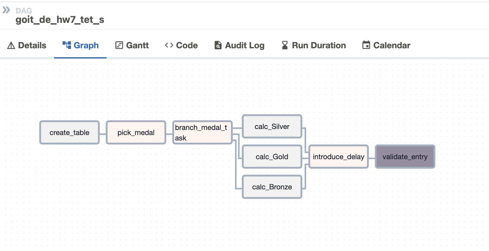
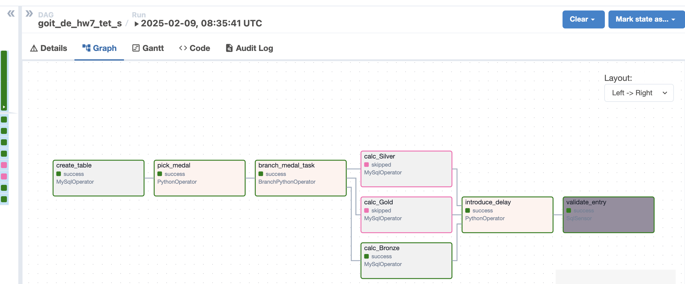
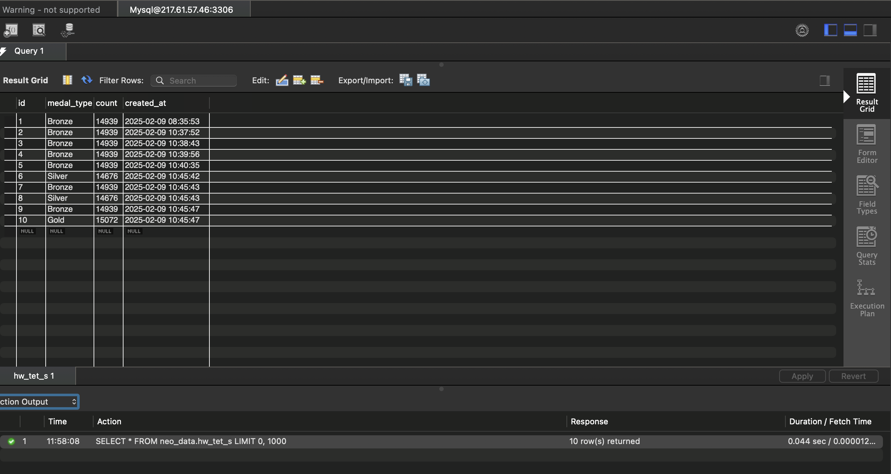
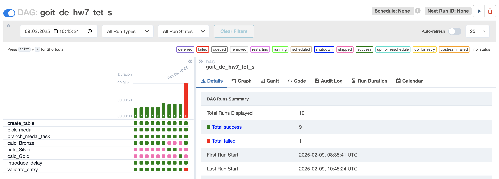

# goit-de-hw-07
The repository for the 6th GoItNeo Data Engineering homework

## Task Description:
Write a DAG that has the following tasks (each item → one task):
1. Create a table.

2. Randomly choose one of the three values ​​['Bronze', 'Silver', 'Gold'].

3. Run one of the three tasks (branches) depending on the chosen value.

4. Description of the three tasks:
    1) The task counts the number of records in the olympic_dataset.athlete_event_results table that contains the Bronze record in the medal field, and writes the resulting value to the table created in item 1, along with the medal type and the time the record was created.

    2) The task counts the number of records in the olympic_dataset.athlete_event_results table that contains the Silver record in the medal field, and writes the resulting value to the table created in item 1, along with the medal type and the time the record was created.

    3) The task counts the number of records in the olympic_dataset.athlete_event_results table that contains the record Gold in the medal field, and writes the resulting value to the table created in step 1, along with the medal type and the time the record was created.

5. Starts a delay for the next task.

6. Check with a sensor whether the newest record in the table created in step 1 is not older than 30 seconds (compared to the current time). The idea is to ensure that the record in the table has been written.

## Task Results:

